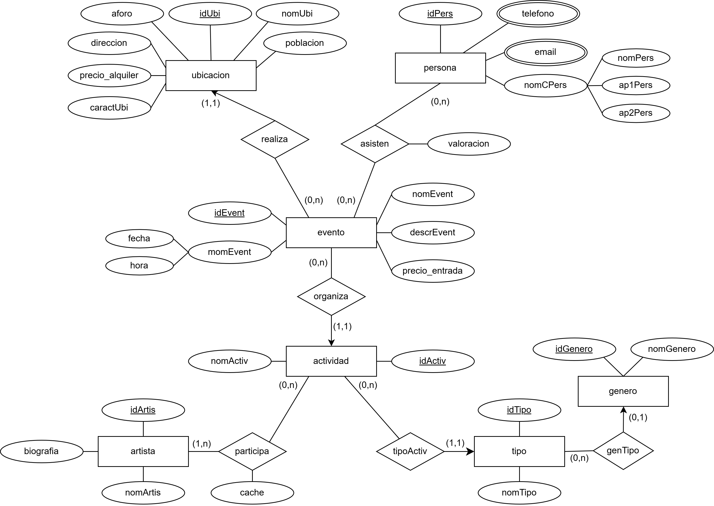

# 🎭 ArteVida Cultural - Database Design and Implementation

## 📖 Project Overview
This repository contains the complete design and implementation of a relational database for "ArteVida Cultural", a fictitious company dedicated to organizing cultural events. The project covers the entire database lifecycle: from requirements gathering and conceptual design (Entity-Relationship Model), to logical design and physical implementation in MySQL.

## 📊 Database Design
To ensure optimal structure and data integrity, the system was fully normalized to the Third Normal Form (3NF). Below is the Entity-Relationship (ER) diagram mapping out the entities, attributes, and relationships:

## 🛠️ Technologies & Concepts
* **Language:** SQL (MySQL)
* **Database Design:** Entity-Relationship (E-R) Model, Relational Model (3NF), Data Normalization.
* **Advanced SQL Features:** * Schema creation (DDL) and data manipulation (DML).
  * Views (`VIEW`) for calculating net profits per event.
  * Triggers (`TRIGGER`) for dynamic capacity control at event locations (`compruebaAsisteAforo`).
  * Complex analytical queries (Subqueries, `INNER JOIN`, `LEFT JOIN`, `RIGHT JOIN`, `GROUP BY`, `HAVING`).

## 📂 Repository Structure
* `docs/`: Contains detailed project documentation, including design justifications, the E-R diagram, and relational schemas.
* `graphics/`: Contains visual assets, including the Entity-Relationship (ER) diagram.
* `sql/`: Contains the unified script to create the database, populate tables with mock data, and execute the analytical queries.

## 🚀 How to Run
To test the database locally:
1. Ensure you have MySQL installed, along with a client like MySQL Workbench or DBeaver.
2. Download the `sql/artevida_db_setup_and_queries.sql` file.
3. Execute the complete script in your environment. The script will create the `ArteVidaCultural` database, populate the tables with testing data, and run 10 analytical queries.
